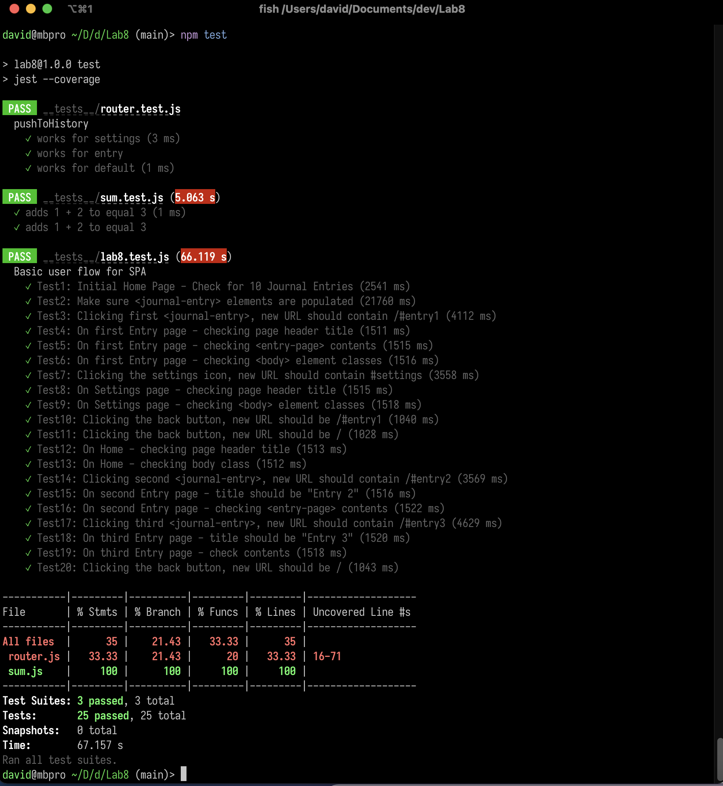

# Lab8_Starter

Partners: David Cao (just me!)



## Check your understanding q's (FILL OUT)
1. In your own words: Where would you fit your automated tests in your Bujo project development pipeline? (just write the letter)

a. (within a Github actions that runs on push)

2. Would you use a unit test to test the “message” feature of a messaging application? Why or why not? For this question, assume the “message” feature allows a user to write and send a message to another user.

No - the "message" feature involves several moving parts and it doesn't make sense to try and unit test this whole feature.

3. Would you use a unit test to test the “max message length” feature of a messaging application? Why or why not? For this question, assume the “max message length” feature prevents the user from typing more than 80 characters

Yes - this is one part of the message feature which can be individually unit tested on its own.

4. What do you expect to happen if we run our puppeteer tests with the field “headless” set to true?

No browser window would pop up when the tests are run.

5. What would your beforeAll callback look like if you wanted to start from the settings page before every test case?

```js
await page.goto('http://127.0.0.1:5500/#settings');
await page.waitForTimeout(500);
```
